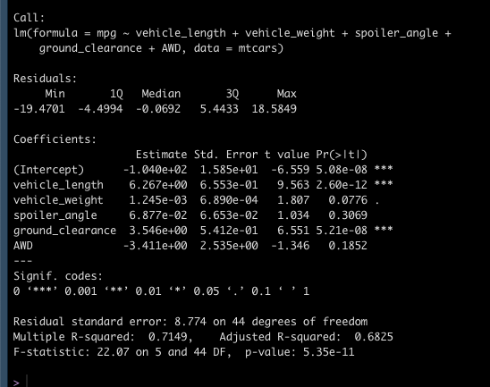
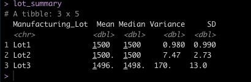
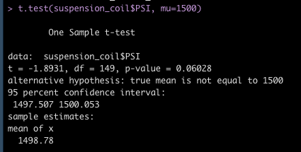
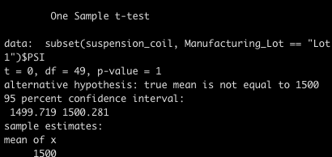
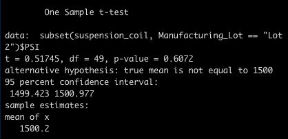
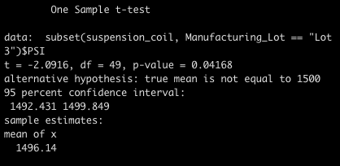

# MechaCar_Statistical_Analysis
## Linear Regression to Predict MPG

Which variables/coefficients provided a non-random amount of variance to the mpg values in the dataset?
The p-value was higher for vehicle weight, spoiler angle, and AWD, so we can conclude that these variables had a higher random variability. Because of this, they have less chance of affecting our mpg. On the flip side, our vehicle length and ground clearance have a very small p-value and we can expect a more significant affect on our mpg.

Is the slope of the linear model considered to be zero? Why or why not?
The slope is not considered zero, the p-value is 5.35e-11, which is less than 0.05.

Does this linear model predict mpg of MechaCar prototypes effectively? Why or why not?
Our R-squared value is .7149 which indicates that the linear model will predict mpg of mechacar accurately 71% of the time. There could be other factors not included in the dataset that contribute to the mpg of mechacar.

## Summary Statistics on Suspension Coils

The design specifications for the MechaCar suspension coils dictate that the variance of the suspension coils must not exceed 100 pounds per square inch. Does the current manufacturing data meet this design specification for all manufacturing lots in total and each lot individually? Why or why not?

Our current manufacturing data summary indicates that met this design specification since the variance of PSI is 62.29, which is under 100 PSI. If we look at the individual lots, lot3 fails this specification with a variance of 170.29.

## T-Tests on Suspension Coils

Our t-test tells us that our p-value is 0.06 which is slightly above the standard 0.05 significance level. We have a 95% confidence interval of 1497.51-1500.05, which means that our mean of 1498.78 falls within our interval.

## Study Design: MechaCar vs Competition
Write a short description of a statistical study that can quantify how the MechaCar performs against the competition. In your study design, think critically about what metrics would be of interest to a consumer: 
In your description, address the following questions:
What metric or metrics are you going to test?
What is the null hypothesis or alternative hypothesis?
What statistical test would you use to test the hypothesis? And why?
What data is needed to run the statistical test?

In this study, we will compare the city and highway fuel efficiency for mechacar and its competitors. We collect data with mpg for each car on both city streets and freeway. Our null hypothesis states that mechacar's city and highway mpg is not different from those of it's competitors. Our alternative hypothesis states that the mechacar mpg is different from it's competitors. Using our t-test, we can compare the data collected.
